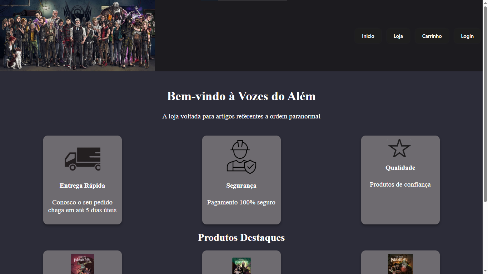
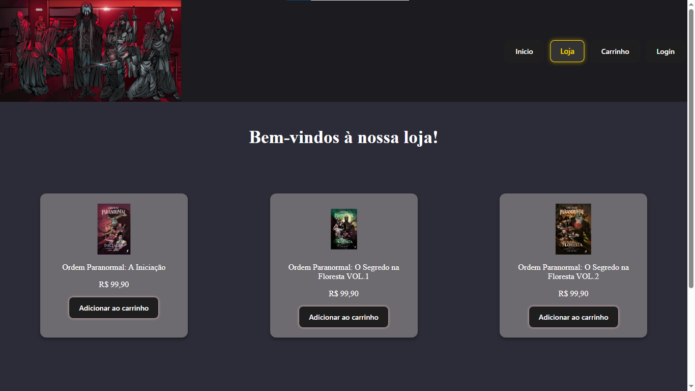
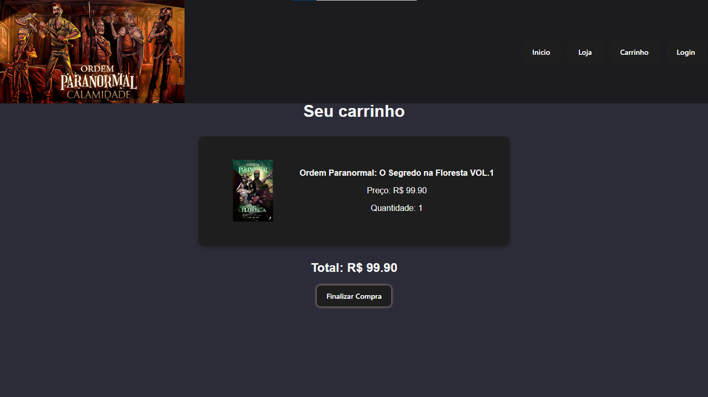
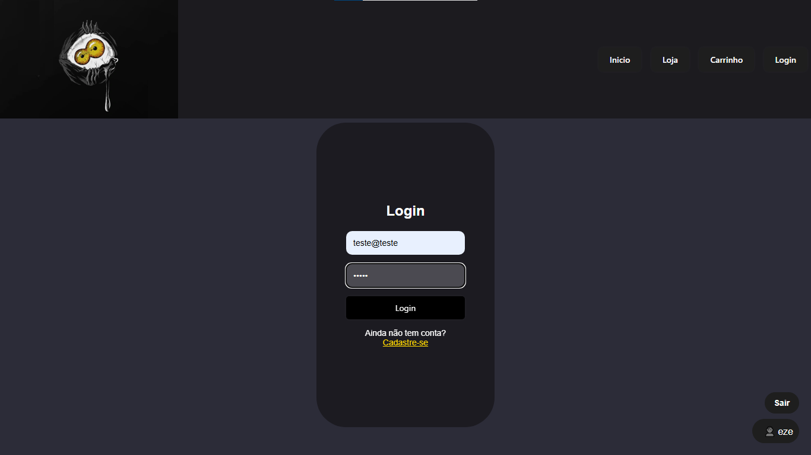
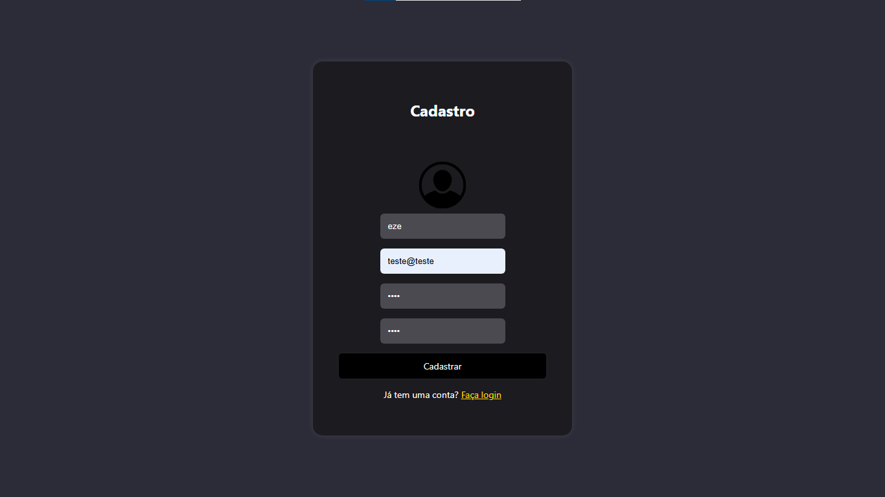

# 👻 Vozes do Além

O **Vozes do Além** é um projeto de site desenvolvido com inspiração no universo de **Ordem Paranormal**, simulando uma loja virtual voltada para os fãs, colecionadores e entusiastas desse universo.

O objetivo do projeto foi praticar conceitos de desenvolvimento web, criando uma experiência simples e intuitiva de navegação em um ambiente de e-commerce.

## Funcionalidades

O site é dividido em quatro áreas principais:

### Início
Página inicial com apresentação da loja e acesso às demais funcionalidades do sistema.

### Loja
Área onde os produtos são exibidos, permitindo que os usuários visualizem os itens disponíveis para compra.

### Carrinho
Seção destinada ao gerenciamento dos produtos selecionados, simulando o funcionamento de um carrinho de compras.

### Login
Página de autenticação para acesso ao sistema, simulando o processo de entrada de usuários através do firebase.

## Objetivos do Projeto

- Praticar conceitos de desenvolvimento web.
- Aplicar conhecimentos de HTML, CSS e JavaScript e Banco de dados para Login.
- Simular o funcionamento básico de um e-commerce.
- Desenvolver habilidades de organização e estruturação de páginas web.
- Criar uma interface inspirada no universo de Ordem Paranormal.

## Tecnologias Utilizadas

- HTML5
- CSS3
- JavaScript
- Firebase

## Aprendizados

Durante o projeto, aprendi a como fazer a estilização de um website, trabalhei com erros de responsividade, e também aprendi a fazer um plugin em um banco de dados online para manter salvo o Login de cada usuário.

## O que faltou?

Para o desenvolvimento de um método de pagamento, necessitaria de mais conhecimento, pois no momento o sistema apenas simula uma compra através de clicks.

## 📌 Observação

Este projeto possui fins educacionais e não tem vínculo oficial com o universo **Ordem Paranormal**. Todo o conteúdo foi desenvolvido apenas para estudo e prática de desenvolvimento web.

## Screenshots

## Projeto Online

https://ezfelin.github.io/Vozes-do-Alem/

